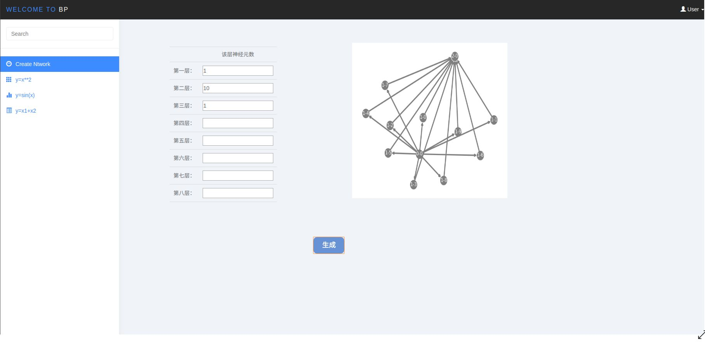
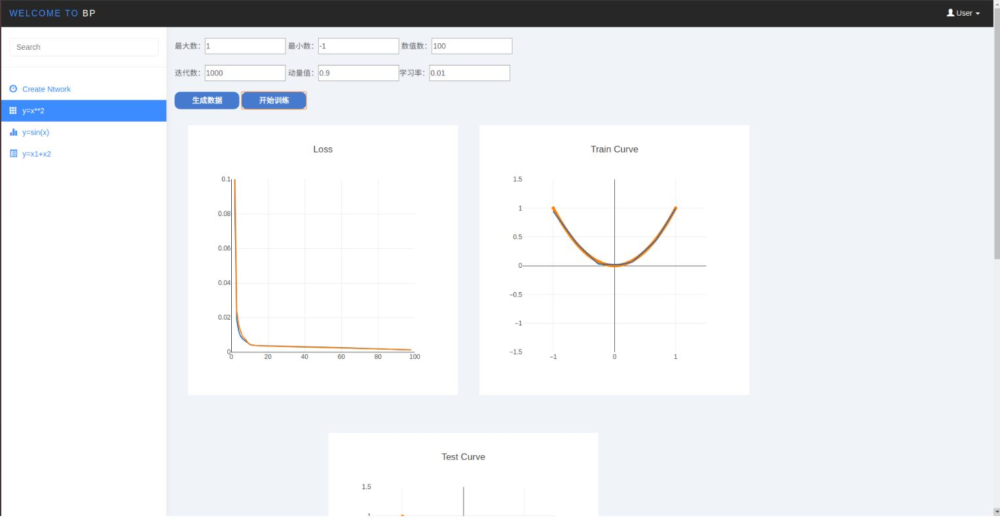
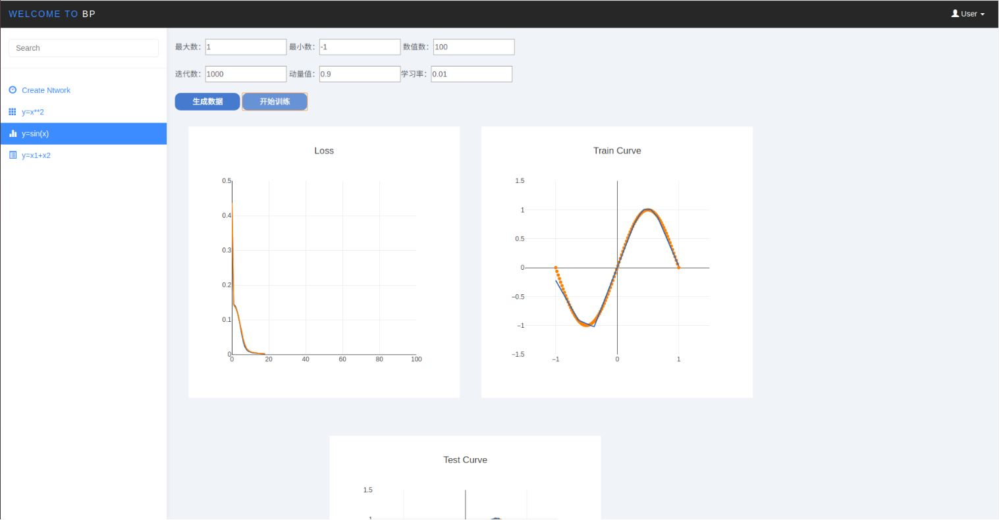
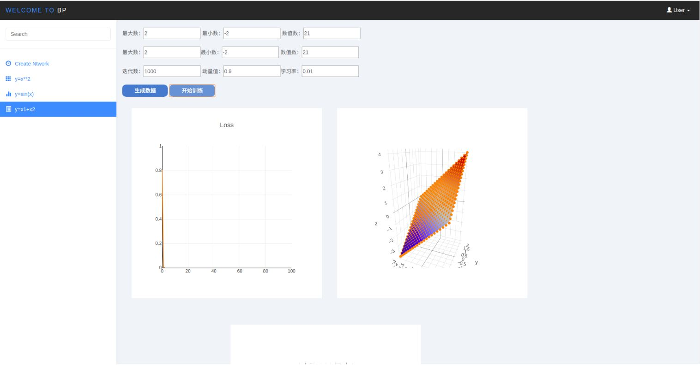

# BP-Neural-Network
> Author: Lijuan Wang

> E-mail: 2015014368@buct.edu.cn

> Date: 2018-05-27

>Description: 纯numpy实现的Bp神经网络，实现了全连接层，MSEloss，Sigmoid、Relu激活函数，以及优化器。前端可实时监控训练集loss与测试集loss以及训练测试集拟合曲线

## 结果展示

### 网络设置
可设置每层神经元个数




### 2d可视化训练
拟合任意一元函数，下面展示sin(x),x^2





### 3d可视化训练
可拟合常用二元曲面




## 代码解析

### 构建计算图
构造了计算图，在前向传播和反向传播中根据相应函数求导。
``` python
class Net:

    def __init__(self):
        self.graph=[] #用来存放计算图
        self.InitInput=None
        self.LR=0.00001
        self.target=None
        self._loss=[]
        self.momentum=1
    
```
### 全连接层
继承基类，实现了基类的方法。将该层参数与梯度封装进Variable，供优化器更新。
``` python
    def LinearLayer(self,input,output,bias=None,weights=None):#0
        l=LLayer(input,output,bias,weights)
        self.graph.append((0,l))

    def LinearLayerForward(self,input,i):
        self.graph[i][1].output=np.dot(input,self.graph[i][1].weight)+self.graph[i][1].bias
        return self.graph[i][1].output

    def LinearLayerBackward(self,input,i,gra,flag=None):
        grad=gra.copy()
        input=np.array(input)
        grad=np.array(grad)
        self.graph[i][1].weight=np.array(self.graph[i][1].weight)
        self.graph[i][1].wgrad=np.dot(input.T,grad)
        self.graph[i][1].bgrad=grad
        self.graph[i][1].grad=np.dot(grad,self.graph[i][1].weight.T)
        return self.graph[i][1].grad
```
### 激活函数
Sigmoid激活函数存在梯度消失的问题，建议使用Relu激活函数
``` python
    def Relu(self):#1
        l=Layer()
        self.graph.append((1,l))

    def ReluForward(self,input,i):
        input=np.array(input)
        self.graph[i][1].output=np.maximum(0,input)
        self.graph[i][1].grad = np.zeros(input.shape[0])
        return self.graph[i][1].output

    def ReluBackward(self,input,i,grad):
        mask=(input==self.graph[i][1].output)
        newgrad=np.zeros(mask.shape)
        newgrad[mask]=1
        self.graph[i][1].grad=grad*newgrad
        return self.graph[i][1].grad
```
``` python
    def Sigmoid(self):#4
        l=Layer()
        self.graph.append((4,l))

    def SigmoidForward(self,input,i):
        input=np.array(input)
        self.graph[i][1].output=1/(np.exp(-input)+1)
        self.graph[i][1].grad=np.zeros(input.shape[0])
        return self.graph[i][1].output

    def SigmoidBackward(self,input,i,grad):
        temp=self.graph[i][1].output*(1-self.graph[i][1].output)
        self.graph[i][1].grad=grad*temp
        return self.graph[i][1].grad
```
### 损失函数
损失函数实现了MSE(均方差损失)
``` python
    def MSELoss(self):#3
        l=Layer()
        self.graph.append((3,l))

    def MSELossForward(self,input,i,label):
        self.graph[i][1].output = (input-label)**2/2
        return self.graph[i][1].output

    def MSELossBackward(self,input,i,grad):
        if self.graph[i][1].output is not None:
            if len(input.shape)<=0:
                input=np.expand_dims(input,axis=0)
            self.graph[i][1].grad=(input-self.target)
            return self.graph[i][1].grad
```

## 局限与不足
本课设由于时间仓促，存在以下局限，供参考者改进：

* 没有实现batch的参数更新

* 只有基础网络结构

## 代码结构
```
BP
│
├── readmeDisplay # 存放本说明文件使用的图片数据
│ 
├── static # 存放网页展示所需的外部js
│ 
├── templates # 存放网页展示所需的html
│   ├── square.html  # 拟合平方函数的html与js
│   ├── sin.html # 拟合正弦函数的html与js
│   └── two.html # 拟合二元函数曲面的html与js
│
├── BPFlask.py # 后端代码
│
├── Network.py # 给后端代码写好调用接口的网络代码
│
└── readme.md # 此说明文件
```

## 环境

* `Python 3.6 `

* 依赖：`flask` `plotly.js`

* 系统支持：`ubuntu` 

* 编程环境:`pycharm`
